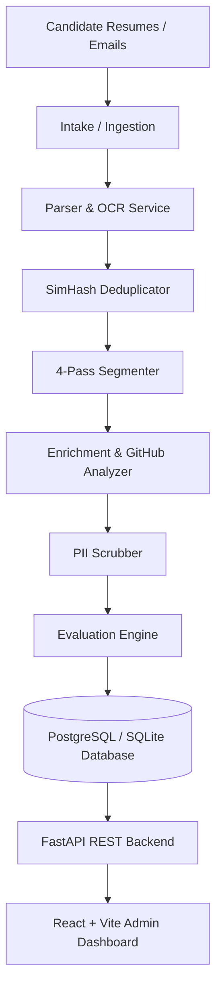

# Resume Evaluation System 🚀

A highly sophisticated, production-grade AI-powered applicant tracking and resume evaluation platform. The system automates candidate intake, deduplicates submissions, segments unstructured resumes, performs deep technical portfolio analysis (including GitHub profile enrichment), and scores candidates using an advanced hybrid NLP & LLM evaluation engine.

---

## 🏗️ Architecture Overview

The platform is designed around a multi-tier, microservices-ready structure:



### 💻 Technology Stack
*   **Backend**: Python 3.11 + FastAPI (High-performance, async REST API)
*   **Frontend**: React 18 + TypeScript + Vite + Tailwind CSS + Zustand (Sleek dark-mode dashboard)
*   **Database & Migrations**: PostgreSQL / SQLite + SQLAlchemy ORM + Alembic migrations
*   **NLP & ML**: `sentence-transformers` (`all-MiniLM-L6-v2`), `spaCy` (`en_core_web_sm`), `scikit-learn` (TF-IDF semantic modeling)
*   **LLM Integration**: OpenAI, Anthropic, Groq, or local Ollama endpoints for advanced reasoning
*   **Parsing & OCR**: `PyMuPDF` (fitz), `python-docx`, plus layout analysis and optional OCR fallback
*   **Reverse Proxy**: Nginx (handling CORS, SSL termination, and static frontend routing)

---

## 🛠️ Key Engine Components & Mathematics

This system goes beyond basic keyword matching. Below is the precise operational logic for the core engineering subsystems.

---

### 1. Document Parsing & Layout Analysis (`parser.py`)
Extracting clean text from resumes is a non-trivial layout-recovery problem. The parser uses a tiered approach:
*   **Tier 1: PyMuPDF (`fitz`) Layout Parsing**: Extracts PDF text using physical block coordinates, parsing paragraphs sequentially to maintain two-column structures.
*   **Tier 2: Docx Native Parsing**: Reads XML-based structures using `python-docx` to extract text blocks, list elements, and embedded tables.
*   **Tier 3: Layout Confidence Scorer**: Scores the visual parsing quality. If structural markers are corrupted (e.g., scanned images disguised as PDFs), it marks the profile as "OCR Required" to flag automated text extraction fallbacks.

---

### 2. SimHash LSH Deduplicator (`deduplicator.py`)
To prevent duplicate applications (even when minor changes like formatting or contact info are adjusted), the system utilizes **Locality Sensitive Hashing (LSH)** with the **SimHash** algorithm:
1.  **Tokenization**: The resume text is broken down into character-level 3-grams.
2.  **Hashing**: Each 3-gram is hashed into a 64-bit value using MD5.
3.  **Vector Summation**: A 64-dimension vector $V$ is created. For each bit position $i$ in a token hash:
    *   If bit $i$ is $1$, add $1$ to $V[i]$.
    *   If bit $i$ is $0$, subtract $1$ from $V[i]$.
4.  **Fingerprint Generation**: The final 64-bit fingerprint $F$ is generated:
    $$F[i] = \begin{cases} 1 & \text{if } V[i] > 0 \\ 0 & \text{if } V[i] \le 0 \end{cases}$$
5.  **Hamming Distance Comparison**: When a new resume is uploaded, its fingerprint is compared with all existing fingerprints in the database using the bitwise Hamming Distance:
    $$\text{Distance}(F_1, F_2) = \text{CountOfBits}(\text{XOR}(F_1, F_2))$$
    *   If the distance is **$\le 3$ bits**, the resume is flagged as a duplicate.

---

### 3. The 4-Pass Segmenter (`segmenter.py`)
Unlike crude regex splits, our resume parser segments raw text into canonical sections (e.g., *Experience, Education, Skills, Projects*) using a robust **4-Pass Sequence Analysis**:

*   **Pass 1: Heuristic Structural Matching**: Scans for lines with specific font-like characteristics: bold-like states, pure upper-cased letters, isolated short lines, or lines containing common structural bullet symbols.
*   **Pass 2: Canonical Lexicon Mapping**: Cross-references lines against a predefined, multi-language dictionary mapping common variations of titles (e.g., `"Work History"`, `"Professional Experience"`, `"Where I've Worked"` $\to$ `EXPERIENCE`).
*   **Pass 3: Levenshtein Distance Matching**: Catches typos or minor formatting variations by calculating edit distances:
    $$\text{Levenshtein}(A, B) \le 2$$
    This matches headings like `"Eduction"` or `"Expreience"` seamlessly.
*   **Pass 4: Dense Vector Embedding Centroid Alignment**: If a section header is ambiguous, the system computes the sentence embedding of the candidate line using `all-MiniLM-L6-v2`. It then calculates the Cosine Similarity against the semantic centroids of canonical sections:
    $$\text{Similarity}(v_1, v_2) = \frac{v_1 \cdot v_2}{\|v_1\| \|v_2\|}$$
    *   If the similarity is **$\ge 0.70$ (configured via `.env`)**, the heading is correctly segmented under its corresponding canonical category.

---

### 4. Deep GitHub Portfolio Analyzer (`github_analyzer.py`)
If a candidate includes a GitHub URL in their profile, a background worker triggers the portfolio analyzer:
1.  **Regex Extraction**: Safely extracts the GitHub username from the resume.
2.  **Metadata Ingestion**: Queries the GitHub REST API to ingest:
    *   User stats (followers, public repos, total gists).
    *   Detailed repository metadata (stars, forks, open issues, repository size).
    *   Commit history activity from public events.
3.  **Weighted Activity Score**: Computes a developer activity rank:
    $$\text{ActivityScore} = (\text{Stars} \times 5.0) + (\text{Forks} \times 3.0) + (\text{TotalRepos} \times 1.0) + (\text{Followers} \times 2.0)$$
4.  **Language Semantic Profile**: Inspects the bytes of each codebase language to construct a primary language distribution.
5.  **JD Semantic Overlap**: Computes a cosine overlap matching score between the developer's public repository topics/descriptions and the target Job Description to highlight real-world alignment.

---

### 5. Dual-Mode Candidate Scoring Engine (`scorer.py`)
Once segmented and enriched, candidates are evaluated against job requirements using one of two modes:

#### 📊 Mode A: Default Hybrid Weighted Scoring
The final score is divided into three customizable buckets (default: **50% Projects**, **30% Skills**, **20% Education**):

*   **Skills Section Recency & Decay Math**:
    Keywords matched in the skills section undergo an exponential calendar-year time-decay to ensure contemporary knowledge:
    $$\text{DecayMultiplier} = e^{-\lambda (Y_{\text{current}} - Y_{\text{used}})}$$
    Where:
    *   $Y_{\text{current}}$ is the current calendar year.
    *   $Y_{\text{used}}$ is the year the skill was last actively used.
    *   $\lambda$ is the decay constant (default `0.05`, meaning older experience has less weight than recent experience).
*   **Projects Bucket Semantic Matching**:
    Combines explicit skill keyword matching in projects with a **TF-IDF + Cosine Similarity** match against the Job Description. The semantic overlap forms 30% of the Projects bucket score.
*   **Education Ranking Matrix**:
    Matches candidate degrees to a standard hierarchy index:
    $$\text{PhD} (100) > \text{Master's} (80) > \text{Bachelor's} (60) > \text{Associate's} (40)$$
    If the candidate's major matches the target field (e.g. "Computer Science"), they receive an additional $20\%$ boost inside the Education bucket.

#### 🎯 Mode B: Requirements-Based Strict Validation
If the recruiter sets explicit constraints for a job (e.g., "5+ years Python, Master's Degree"), the engine transitions to strict parsing mode:
*   **Experience Duration Extraction**: Runs NLP noun-chunk rules & regular expressions to locate numbers adjacent to duration strings in work history nodes (e.g., `"Python (4 yrs)"`, `"Software Engineer (2018 - 2022)"`).
*   **Strict Boolean Filters**: Disqualifies or flags candidates failing to meet minimum experience, specific key tech requirements, or education thresholds.

---

### 6. PII Scrubber & Blind Evaluation (`pii_scrubber.py`)
To prevent unconscious bias, the system provides a "Blind Evaluation" mode that sanitizes candidate information:
*   **Redaction Pipeline**: Uses spaCy Named Entity Recognition (NER) combined with strict regex tables to redact:
    *   **Names**: (e.g., `"John Doe"` $\to$ `[CANDIDATE_NAME]`)
    *   **Emails**: (e.g., `"[email_redacted]"`)
    *   **Phone Numbers**: (e.g., `"[phone_redacted]"`)
    *   **Specific Locations & Address Strings**

---

### 7. Automated Email Intake Pipeline (`email_ingestion.py`)
Recruiters don't need to manually upload every resume. The background engine acts as an intake processor:
1.  **IMAP Polling**: Securely connects to a configured inbox (e.g., `careers@company.com`) at regular intervals.
2.  **Attachment Extraction**: Automatically identifies PDF, DOCX, and text files attached to incoming emails.
3.  **Profile Creation**: Parses the attachments, correlates the email sender as the candidate's primary contact, and queues the candidate in the dashboard under the corresponding job opening.

---

## 🚀 Getting Started (Local Setup)

The quickest way to run the entire stack (Database, Backend, Frontend, and Nginx proxy) is using **Docker Compose**:

### 1. Clone & Prepare Configurations
```bash
git clone https://github.com/MounishKakarla/ResumeEvaluator.git
cd ResumeEvaluator/resume-eval

# Copy environment template files
cp .env.example .env
cp backend/.env.example backend/.env
cp frontend/.env.example frontend/.env
```

### 2. Run with Docker Compose
```bash
docker compose up --build
```

Once running:
*   **Frontend Client**: [http://localhost:5173](http://localhost:5173) (Proxied through Nginx at [http://localhost](http://localhost))
*   **FastAPI REST API**: [http://localhost:8000](http://localhost:8000)
*   **Interactive API Documentation**: [http://localhost:8000/docs](http://localhost:8000/docs)

---

## 📂 Project Directory Structure

```text
resume-eval/
├── backend/
│   ├── alembic/                # DB Migrations history
│   ├── app/
│   │   ├── middleware/         # Rate limiting & CORS middlewares
│   │   ├── routers/            # FastAPI API endpoints (Upload, Evaluator, Analytics)
│   │   ├── services/           # CORE CALCULATIONS & ENGINE FILES
│   │   │   ├── parser.py       # PDF/Docx parser
│   │   │   ├── segmenter.py    # 4-Pass structural segmenter
│   │   │   ├── deduplicator.py # SimHash LSH duplicate engine
│   │   │   ├── scorer.py       # Dual-mode weighted scoring algorithm
│   │   │   ├── github_analyzer.py # GitHub REST portfolio scoring
│   │   │   └── pii_scrubber.py # Bias-free PII redaction pipeline
│   │   ├── database.py         # SQLAlchemy Session configuration
│   │   ├── models.py           # Database Schemas (Candidates, Jobs, Scores)
│   │   └── main.py             # FastAPI App initialisation
│   ├── Dockerfile
│   └── requirements.txt
├── frontend/
│   ├── src/
│   │   ├── components/         # Reusable UI widgets (NavBar, SkillTags, ScoreBars)
│   │   ├── pages/              # Leaderboard, Candidate detail, Configuration pages
│   │   ├── store/              # State management via Zustand (useAppStore.ts)
│   │   └── App.tsx             # Application routing & layouts
│   ├── Dockerfile
│   └── package.json
├── nginx/
│   └── nginx.conf              # Reverse proxy routing
├── docker-compose.yml          # Local orchestration setup
└── README.md                   # System documentation
```

---

## 🤝 Verification & Automated Testing

You can run the suite of automated unit tests to verify the core algorithms (deduplication, parsing, 4-pass segmentation, and evaluation engines) are performing correctly:

```bash
# Enter the backend directory and activate your virtual environment
cd backend
pip install -r requirements.txt
pytest
```
*(The test suite automatically tests layout parsers, SimHash collision rates, Levenshtein distances, and mock evaluation runs).*
